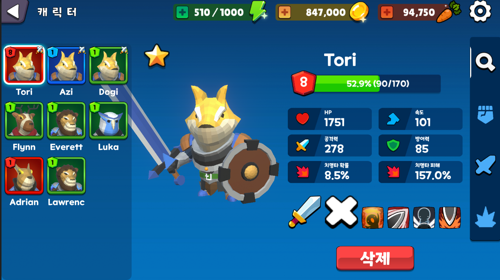
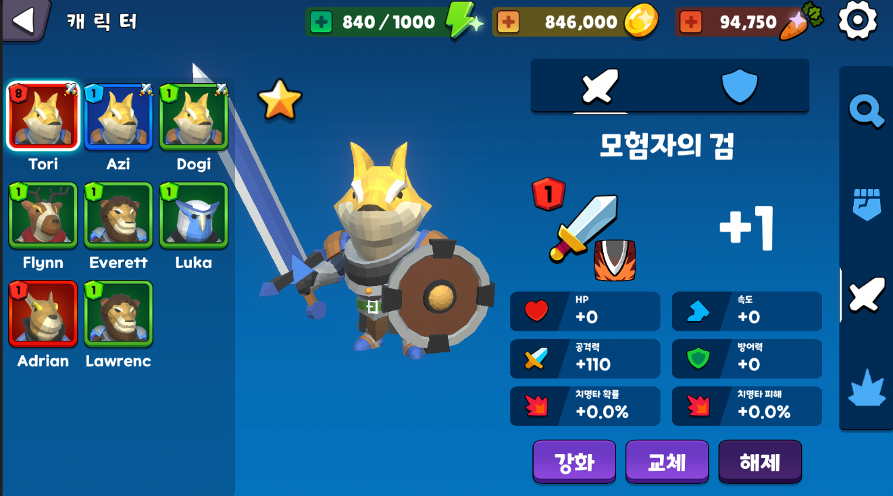
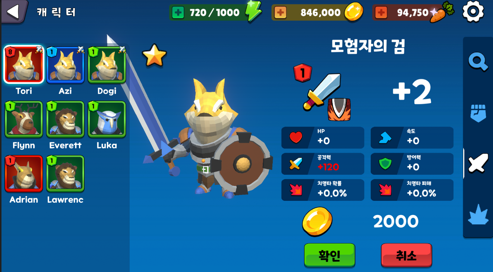
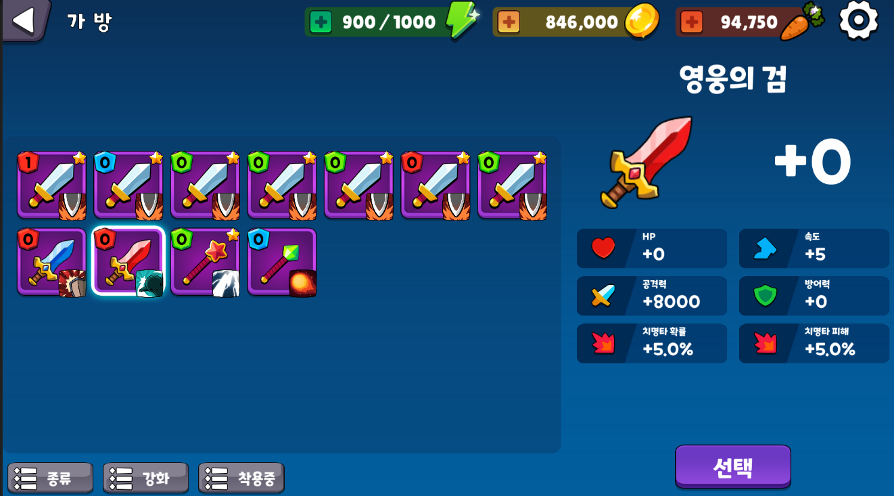

# AnimalKingdom-reconstructed

Portfolio repository reconstructed from a released Unity game project.

## Overview

This repository is a reconstructed portfolio project based on an existing Unity project.
Only the parts I personally contributed to have been extracted and reorganized.
The purpose of this repository is not to provide a fully playable build, but to showcase
system design and code structure.

## Game Introduction

This project is a reconstructed portfolio sample extracted from the Unity game project 'Animal Kingdom'.
Animal Kingdom is a character-centric turn-based RPG where players collect and develop characters through leveling, equipment, and skills.
This repository focuses on the character management flow as a representative gameplay system.

## Screenshots

### Character Management

  

### Equipment Management & Enhancement

  
  

### Equipment Change (Inventory-Based Equipment Selection)

  

## Sample Scope

For portfolio purposes, this repository focuses specifically on the character management flow, excluding unrelated gameplay systems.
This repository covers the following features:
- Character creation, selection, and removal
- Equipment management (weapon / armor equip, unequip, and enhancement)
- Stat recalculation based on level, equipment, and passive skills
- Inventory-based item management
- UI-driven interaction flow for character management

## Design Focus

This sample is designed to demonstrate:
- Clear separation between domain models and UI controller logic
- Data-driven character and inventory systems
- Practical Unity architecture for managing complex UI interactions
- Code structure from a released mobile game project

All included scripts represent my personal contributions to the original project and have been reorganized 
and documented to highlight design intent and implementation details.

## Code Overview

This repository contains a curated subset of scripts focused on the character management flow,
highlighting the separation between domain models and UI controller logic.

### Script Structure

This repository is organized around a clear separation between
core domain models (character, inventory) and UI controller logic
that orchestrates player interactions.

### Domain Models

#### `Character.cs`
Core domain entity representing a playable character and its runtime state.

#### `Inventory.cs`
Container object that holds and provides access to owned items.

### UI Controllers

#### `CharacterMain.cs`
UI controller that coordinates character-related screens, user interactions, and scene-level flow.

#### `UICharacterEquipment.cs`
UI controller responsible for displaying and handling equipment-related interactions for a character.

## Code Explanation

This section explains how the selected scripts collaborate to implement
the character management flow, focusing on responsibility boundaries
rather than line-by-line implementation details.

### Domain Models

**Character** and **Inventory** form the core domain layer of the system.

- `Character` encapsulates all character-related state and gameplay rules,
  including leveling, stat calculation, equipment handling, and progression.
- `Inventory` acts as a container for item-related domain objects and provides
  centralized access for item lookup, addition, and removal.

These classes are designed to remain independent from UI concerns and
operate purely on game data and rules.

### UI Controllers

UI controller scripts coordinate player interactions and screen-level flow.

- `CharacterMain` functions as the main coordinator for character-related scenes.
  It manages character selection, tab navigation, model presentation, and
  communication between UI components and domain models.
- `UICharacterEquipment` handles equipment-related UI interactions such as
  equipping, unequipping, and enhancement previews, while delegating actual
  game logic to the domain layer.

UI controllers do not own gameplay rules; instead, they invoke domain logic
and update visual state based on the results.

## Build

To demonstrate how the character management flow operates in-game,
a playable Android APK build has been generated from the original project.

- Platform: Android
- Build type: Release
- Distribution: GitHub Releases
- Build base commit: v1.0-apk

¢º Download APK  
https://github.com/javaCof/AnimalKingdom-reconstructed/releases/tag/v1.0-portfolio

## Notes for Reviewers

- This repository focuses on a specific gameplay flow rather than a complete project.
- Some systems (combat, progression balance, content data) are intentionally excluded.
- Code is organized to emphasize responsibility boundaries rather than runtime completeness.
